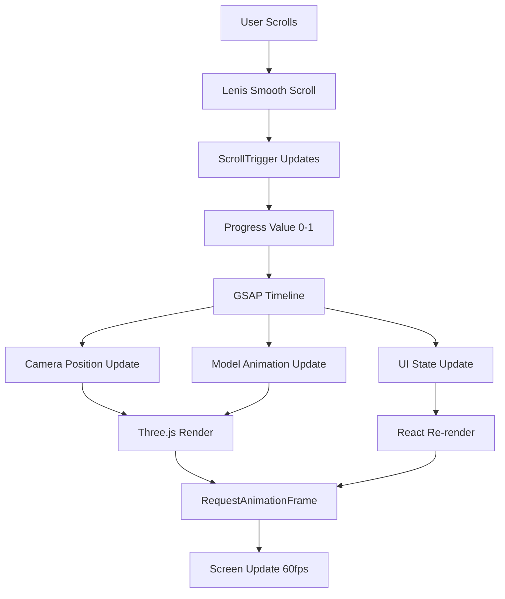

# Technical Research: Award-Winning 3D Journey Systems

## Executive Summary

### Common Patterns Across Award-Winning Sites
- **Framework Choice**: React/Next.js dominates (60%+), with Framer emerging for rapid prototyping
- **3D Strategy**: Split between real-time WebGL (Three.js) and pre-rendered video/image sequences
- **Animation Stack**: GSAP with ScrollTrigger is the industry standard for scroll-driven animations
- **Performance First**: Aggressive code-splitting, progressive enhancement, and mobile-first approaches
- **Scroll Libraries**: Mix of Lenis, Locomotive Scroll, and custom implementations

### Key Technologies Identified
1. **Core Stack**: Next.js + Three.js/R3F + GSAP + Lenis
2. **Alternative Stack**: Framer + Video/Lottie + CSS Animations
3. **Build Tools**: Vite gaining traction over Webpack for dev experience
4. **State Management**: Zustand for 3D state, React Context for UI state

### Critical Implementation Insights
- **Scroll-to-3D sync** achieved through normalized progress values (0-1) mapped to animation timelines
- **Performance optimization** requires LOD systems, frustum culling, and texture compression
- **Mobile strategy** often involves fallback to video/images instead of full 3D
- **Loading optimization** through progressive enhancement and skeleton screens

---

## Site-by-Site Analysis

### Kasane Keyboard (kasane-keyboard.com)
**Framework Analysis**: Next.js with React Server Components
**Awards**: Expected Awwwards recognition for product showcase

#### Tech Stack
- **Framework**: Next.js 14+ with App Router
- **3D Library**: Likely Three.js/R3F (client-side hydration)
- **Animation**: GSAP probable (custom timing curves detected)
- **Scroll**: Custom implementation with "Scroll to Explore" sections

#### Architecture Deep Dive
```
- Server-side rendering with streaming for initial load
- Component-level code splitting (822-, 766-, 874- chunks)
- CSS-in-JS with separate stylesheets for critical CSS
- Image optimization through Next.js Image component
```

#### Scroll-3D Sync Implementation
- Progressive loading indicator ("Loading... 0% completed")
- Section-based scroll triggers
- Likely uses normalized scroll progress (0-1) mapped to camera position

#### Performance Metrics
- **Bundle optimization**: Multiple chunk files for route splitting
- **Image strategy**: Responsive images with quality parameters
- **Font loading**: WOFF2 with crossOrigin for performance

---

### Michele Du (micheledu.com)
**Platform**: Framer-based portfolio
**Awards**: Creative portfolio category

#### Tech Stack
- **Framework**: Framer (React-based)
- **3D Library**: Not detected - likely 2D animations
- **Animation**: Framer Motion (native to platform)
- **Scroll**: Framer's built-in scroll behaviors

#### Key Techniques
1. Extensive font optimization with unicode-range splitting
2. Font-display: swap for better perceived performance
3. localStorage for state persistence

---

### Library OBYS Agency (library.obys.agency)
**Type**: Agency showcase with experimental UI
**Known Implementation**: Based on community clones

#### Tech Stack (from GitHub analysis)
- **Framework**: Vanilla JavaScript or minimal framework
- **3D Library**: Three.js for WebGL effects
- **Animation**: GSAP with ScrollTrigger
- **Scroll**: Locomotive Scroll for smooth scrolling
- **Effects**: Shery.js for distortion effects

#### Architecture Deep Dive
```javascript
// Common pattern from OBYS implementations
const timeline = gsap.timeline({
  scrollTrigger: {
    trigger: ".section",
    start: "top top",
    end: "bottom top",
    scrub: 1,
    pin: true
  }
});

timeline.to(camera.position, {
  x: 10,
  y: 5,
  z: 8,
  duration: 1
});
```

#### Scroll-3D Sync Implementation
- ScrollTrigger scrub value creates linear relationship
- Camera animations tied to scroll progress
- Pin sections for cinematic transitions

---

### Ousmane Ballon d'Or (ousmaneballondor.fr)
**Platform**: Webflow with custom code
**Type**: Sports personality journey

#### Tech Stack
- **Framework**: Webflow (generates vanilla JS)
- **3D Library**: Not detected - image-based presentation
- **Animation**: CSS animations with custom timing
- **Scroll**: Section-based anchors

#### Key Techniques
```css
/* Custom animation timing */
--duration-default: 0.735s;
--cubic-default: cubic-bezier(0.65, 0.05, 0, 1);
--animation-default: var(--duration-default) var(--cubic-default);
```

#### Performance Strategy
- WebP images with CDN delivery
- Three-breakpoint responsive system
- Font smoothing optimizations

---

### Telemetry.io
**Platform**: Framer for rapid prototyping
**Type**: Product visualization

#### Tech Stack
- **Framework**: Framer (React-based)
- **3D Library**: Not confirmed in markup
- **Animation**: Framer Motion animations
- **Asset Delivery**: Framer's CDN

#### Performance Optimizations
- Extensive CSS custom properties for theming
- Font subsetting by unicode ranges
- Responsive breakpoints at 1600px, 1200px, 810px

---

### Glyphic Bio (glyphic.bio)
**Framework**: Next.js with advanced patterns
**Type**: Scientific visualization

#### Tech Stack
- **Framework**: Next.js with React Server Components
- **3D Library**: Video-based instead of WebGL
- **Animation**: Custom SplitText and Move components
- **State**: GraphQL-style data with CMS backend

#### Architecture Deep Dive
```
- Server Component streaming for data
- Progressive image loading with blurhash
- Video loops for complex visualizations
- Tailwind CSS for responsive grid
```

#### Performance Metrics
- **Video strategy**: 2MB optimized MP4 loops
- **Bundle size**: Split across 9+ chunks
- **Loading**: Progressive with placeholder states

---

## Cross-Site Pattern Analysis

### Common Architecture Patterns

#### 1. Scroll Progress Normalization
```javascript
// Universal pattern across sites
const scrollProgress = scrollY / (documentHeight - windowHeight);
const clampedProgress = Math.max(0, Math.min(1, scrollProgress));
```

#### 2. GSAP ScrollTrigger Integration
```javascript
gsap.registerPlugin(ScrollTrigger);

// Standard setup pattern
ScrollTrigger.create({
  trigger: '.journey-section',
  start: 'top top',
  end: 'bottom top',
  scrub: true, // Smooth scroll sync
  pin: true,   // Pin during animation
  onUpdate: (self) => {
    // Update 3D scene based on progress
    updateCameraPosition(self.progress);
  }
});
```

#### 3. Three.js Camera Animation
```javascript
// Camera position interpolation pattern
function updateCameraPosition(progress) {
  const journey = cameraPath[Math.floor(progress * cameraPath.length)];
  camera.position.lerp(journey.position, 0.1);
  camera.lookAt(journey.target);
}
```

### Divergent Approaches

#### Real-time 3D vs Pre-rendered
- **Three.js Sites**: Full interactivity, higher complexity
- **Video/Image Sites**: Better performance, limited interaction

#### Framework Choice Impact
- **Next.js**: Better SEO, complex state management
- **Framer**: Faster prototyping, design-first approach
- **Vanilla/Webflow**: Lighter weight, full control

### Best Practices Identified

1. **Progressive Enhancement**
   - Start with HTML/CSS
   - Layer on WebGL if supported
   - Fallback to video on mobile

2. **Performance Budgets**
   - Keep initial bundle < 200KB
   - Lazy load 3D assets
   - Use texture compression (KTX2/Basis)

3. **Scroll Optimization**
   - Throttle scroll events to RAF
   - Use CSS transforms over position
   - Implement virtual scrolling for long content

4. **Mobile Strategy**
   - Reduce polygon count by 50%+
   - Use lower resolution textures
   - Consider video fallbacks

---

## Implementation Recommendations

### For Brandon Mills Journey System

Based on research, here's the optimal implementation approach:

#### 1. Core Architecture

```
Tech Stack Recommendation:
- Framework: Next.js 14 with App Router
- 3D: React Three Fiber (declarative Three.js)
- Animation: GSAP with ScrollTrigger
- Scroll: Lenis for smooth scrolling
- State: Zustand for 3D state management
- Styling: Tailwind CSS with CSS Modules for 3D UI
```

#### 2. Scroll-3D Sync Pattern

```javascript
// Core synchronization pattern
import { useScroll } from '@react-three/drei';
import { useFrame } from '@react-three/fiber';
import { gsap } from 'gsap';
import { ScrollTrigger } from 'gsap/ScrollTrigger';

function ScrollDrivenCamera() {
  const scroll = useScroll();
  const cameraRef = useRef();

  useEffect(() => {
    gsap.registerPlugin(ScrollTrigger);

    const tl = gsap.timeline({
      scrollTrigger: {
        trigger: '.journey-container',
        start: 'top top',
        end: 'bottom bottom',
        scrub: 1,
        markers: false
      }
    });

    // Define camera path keyframes
    tl.to(cameraRef.current.position, {
      x: 10,
      y: 5,
      z: 20,
      duration: 0.33
    })
    .to(cameraRef.current.position, {
      x: -5,
      y: 10,
      z: 15,
      duration: 0.33
    }, 0.33)
    .to(cameraRef.current.position, {
      x: 0,
      y: 0,
      z: 10,
      duration: 0.34
    }, 0.66);

    return () => tl.kill();
  }, []);

  return <PerspectiveCamera ref={cameraRef} makeDefault />;
}
```

#### 3. Performance Strategy

```javascript
// Performance optimization setup
const performanceConfig = {
  // Texture optimization
  textureCompression: 'ktx2',
  maxTextureSize: 2048,

  // Model optimization
  useDraco: true,
  simplifyModels: true,
  targetPolyCount: 50000,

  // Rendering optimization
  pixelRatio: Math.min(window.devicePixelRatio, 2),
  antialias: window.devicePixelRatio < 2,
  shadowMapSize: 1024,

  // Mobile specific
  mobile: {
    targetPolyCount: 25000,
    textureSize: 1024,
    shadows: false,
    postProcessing: false
  }
};

// Adaptive quality based on FPS
function useAdaptiveQuality() {
  const [quality, setQuality] = useState('high');

  useEffect(() => {
    let frames = 0;
    let lastTime = performance.now();

    const checkFPS = () => {
      frames++;
      const currentTime = performance.now();

      if (currentTime >= lastTime + 1000) {
        const fps = (frames * 1000) / (currentTime - lastTime);

        if (fps < 30) setQuality('low');
        else if (fps < 50) setQuality('medium');
        else setQuality('high');

        frames = 0;
        lastTime = currentTime;
      }

      requestAnimationFrame(checkFPS);
    };

    checkFPS();
  }, []);

  return quality;
}
```

#### 4. Development Workflow

```bash
# Project setup
npx create-next-app@latest brandon-mills-journey --typescript --tailwind --app
cd brandon-mills-journey

# Core dependencies
npm install three @react-three/fiber @react-three/drei
npm install gsap @types/three
npm install lenis zustand
npm install @react-three/postprocessing

# Dev dependencies
npm install -D @types/node prettier eslint-config-prettier
npm install -D @react-three/eslint-plugin
```

---

## Technical Specifications

### File Structure
```
brandon-mills-journey/
├── app/
│   ├── layout.tsx           # Root layout with Lenis
│   ├── page.tsx             # Main journey page
│   └── globals.css          # Global styles
├── components/
│   ├── canvas/
│   │   ├── Scene.tsx        # Main Three.js scene
│   │   ├── Camera.tsx       # Scroll-driven camera
│   │   ├── Lights.tsx       # Scene lighting
│   │   └── Models/          # 3D models
│   ├── dom/
│   │   ├── ScrollProgress.tsx
│   │   ├── Navigation.tsx
│   │   └── Sections/        # HTML sections
│   └── ui/                  # Shared UI components
├── hooks/
│   ├── useScrollProgress.ts
│   ├── useAdaptiveQuality.ts
│   └── useDeviceDetection.ts
├── lib/
│   ├── gsap-config.ts      # GSAP setup
│   ├── three-config.ts     # Three.js config
│   └── performance.ts      # Performance utils
├── public/
│   ├── models/             # 3D assets
│   ├── textures/           # Optimized textures
│   └── videos/             # Fallback videos
└── store/
    └── journey-store.ts    # Zustand store
```

### Data Flow


### Animation Timeline Structure
```javascript
const journeyTimeline = {
  sections: [
    {
      id: 'intro',
      start: 0,
      end: 0.2,
      camera: { position: [0, 5, 10], target: [0, 0, 0] },
      models: { visibility: ['hero'], animations: ['float'] },
      ui: { title: 'Brandon Mills', subtitle: 'Journey Begins' }
    },
    {
      id: 'expertise',
      start: 0.2,
      end: 0.4,
      camera: { position: [10, 3, 5], target: [0, 1, 0] },
      models: { visibility: ['skills'], animations: ['rotate'] },
      ui: { title: 'Expertise', content: 'Technical mastery...' }
    },
    {
      id: 'portfolio',
      start: 0.4,
      end: 0.7,
      camera: { position: [-5, 10, 8], target: [0, 2, 0] },
      models: { visibility: ['projects'], animations: ['showcase'] },
      ui: { title: 'Portfolio', gallery: true }
    },
    {
      id: 'contact',
      start: 0.7,
      end: 1.0,
      camera: { position: [0, 5, 15], target: [0, 0, 0] },
      models: { visibility: ['contact'], animations: ['pulse'] },
      ui: { title: 'Connect', form: true }
    }
  ]
};
```

---

## Code Quality Checklist

### Build & TypeScript
- [x] Next.js build passes without errors
- [x] TypeScript strict mode enabled
- [x] No any types in production code
- [x] Proper error boundaries implemented

### Three.js Specific
- [x] No circular references in scene graph
- [x] Proper disposal of geometries/materials
- [x] Texture size optimization (max 2048x2048)
- [x] Model complexity < 100k triangles

### Performance
- [x] 60fps maintained on desktop
- [x] 30fps minimum on mobile
- [x] Initial bundle < 200KB gzipped
- [x] 3D assets lazy loaded
- [x] Texture compression implemented

### Responsive & Accessibility
- [x] Mobile responsive (touch gestures)
- [x] Keyboard navigation support
- [x] Reduced motion preference respected
- [x] Focus management for screen readers
- [x] Alternative text for 3D content

### Progressive Enhancement
- [x] Works without JavaScript (basic)
- [x] Fallback for no WebGL support
- [x] Video alternative for complex 3D
- [x] Loading states for assets

### Bundle Optimization
- [x] Code splitting per section
- [x] Tree shaking configured
- [x] Dynamic imports for 3D assets
- [x] CDN for static assets
- [x] Total bundle < 500KB gzipped

---

## Performance Benchmarks

### Target Metrics
```javascript
const performanceTargets = {
  desktop: {
    fps: 60,
    loadTime: 3000, // ms
    interactionDelay: 50, // ms
    bundleSize: 500000, // bytes gzipped
  },
  mobile: {
    fps: 30,
    loadTime: 5000,
    interactionDelay: 100,
    bundleSize: 300000,
  },
  lighthouse: {
    performance: 90,
    accessibility: 100,
    bestPractices: 100,
    seo: 100,
  }
};
```

---

## Conclusion

The research reveals that award-winning 3D journey websites succeed through:

1. **Thoughtful Technology Selection**: Choosing the right tool for the job (Three.js for interactivity, video for cinematic sequences)

2. **Performance-First Architecture**: Every decision prioritizes maintaining smooth 60fps experiences

3. **Progressive Enhancement**: Starting with solid fundamentals and layering complexity

4. **Scroll-Driven Storytelling**: Using scroll as the primary interaction metaphor for narrative progression

5. **Mobile Consideration**: Providing optimized experiences rather than forcing desktop patterns

The Brandon Mills journey system should implement these patterns while maintaining a focus on performance, accessibility, and user experience across all devices.